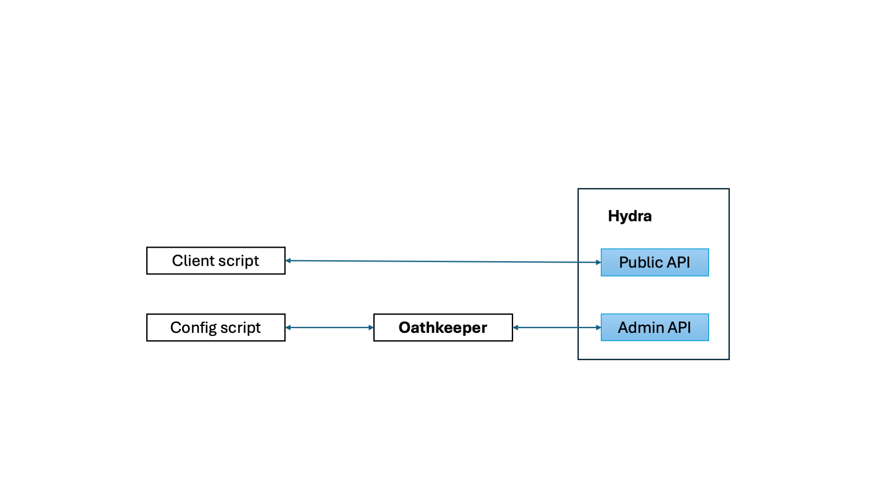

# authorization-and-authentication

This is an initial demo version of the TRACE4EU authorization-and-authentication service, currently based on [Ory](https://www.ory.sh/).

This is part of TRACE4EU T2.2:

* https://nextcloud.trace4eu.eu/apps/files/files/29886?dir=/TRACE4EU/WP2%20Technology%2C%20interoperability%20and%20cybersecurity/T22

**Warning:** This is a demo component, NOT ready for production! Secrets are currently hardcoded inside this repo. Use at your own risk!

This component uses:
* [Ory hydra](https://www.ory.sh/hydra/)
* [Ory oathkeeper](https://www.ory.sh/docs/oathkeeper)

# Component modules


OAuth 2.0 functionality of this component is handled by Ory hydra. It's [administration API](https://www.ory.sh/docs/hydra/reference/api)
is protected using oathkeeper and [JWT authenticator](https://www.ory.sh/docs/oathkeeper/pipeline/authn#jwt).
Particularly, applications wishing to perform administrative operations (e.g., add/edit clients) 
should include a JWT in the HTTP Authorization header of their requests
JWTs should be signed using a key included in oathkeeper's configuration folder.

The provided example scripts in the `scenarios` folder are pre-configured with such a
JWT. Nevertheless, for security reasons, new deployments must generate a new JWT. This can
be achieved using the `generate_api_jwt.py` script located in the `scripts` folder. 

# Run
From the compose directory execute:

```bash
docker-compose -f authorization-and-authentication.yml up --build
```

This will create an instance of the authorization and authentication service. The 
following table includes the available endpoints.

Endpoint | Url
---|---
Administration API URL| http://localhost:4445/
OAuth 2.0 token endpoint | http://localhost:4444/oauth2/token
OAuth2.0 token introspection | http://localhost:4445/oauth2/introspect


# Examples
In this section we present various authentication and authorization scenarios that
can be implemented using this service. The scripts for each example are located inside
the `examples` folder. The provided pythons scripts require the `jwcrypto` library which
can be installed using the following command:

```bash
python3 -m pip install jwcrypto
```

## Scenario 1: Client application authorization authorized by offchain storage component admin to access data
In this scenario, TRACE4EU offchain storage component authorizes a client application to access a data item. 
It is assumed that authorizations are modeled as scopes in the form of 
`<item uri>,<access right>`, e.g., `http://trace4.eu/ocs/item1,read`.
Furthermore, clients applications are [authenticated using JWTs](https://datatracker.ietf.org/doc/html/rfc7523#section-2.2) 
and OAuth 2.0 [client credentials grant](https://datatracker.ietf.org/doc/html/rfc6749#section-4.4)

### Step 1: Admin, client application registration
In this step, an `admin` script executed by the offchain storage component configures
the authorization and authentication service with the client application public key. Client application keys
are expressed as JSON Web keys. An example of suitable
JSON Web key follows (this is the key used by our examples).

```
{
    "crv":"P-256",
    "kty":"EC",
    "x":"3qmoY1Bs0eJ319TLku5ofe7q2guicdFSIu22miBLXHY",
    "y":"gRzDzzvTGuyJp7ypFWuboC21KhsxpcpQMo9IcXSt23E",
    "kid":"test-client-jwt-jwk#1",
    "use":"sig"
}
```

A client application that supports this type of authentication can be added by performing an HTTP POST at the `clients` 
endpoint of the administration API URI. An example of valid payload follows:

```json
{
    "client_id": "test-client-jwt",
    "grant_types": [
        "client_credentials"
    ],
    "token_endpoint_auth_method": "private_key_jwt",
    "token_endpoint_auth_signing_alg": "ES256",
    "jwks": {
        "keys": [
            {
                "kty": "EC",
                "use": "sig",
                "kid": "test-client-jwt-jwk#1",
                "crv": "P-256",
                "x": "3qmoY1Bs0eJ319TLku5ofe7q2guicdFSIu22miBLXHY",
                "y": "gRzDzzvTGuyJp7ypFWuboC21KhsxpcpQMo9IcXSt23E"
            }
        ]
    }
}
```
The `admin.py` script located in folder `examples/scenario1` includes a python script
for creating such a client.

### Step 2: Admin, configure client application scopes
The scopes a client application can access correspond to its access rights. A client application is configured with a `scope` parameter
with space delimited scopes, e.g., :

`scope = "http://trace4.eu/ocs/item1,read http://trace4.eu/ocs/item1,write http://trace4.eu/ocs/item3,read"`

Unfortunately, every time an access right is modified the `scope` parameter must be re-created. The `scope` parameter
of a client application can be modified by performing an HTTP PATCH operation at the `clients\{client_id}` endpoint of 
administration API URI with the following payload:

```
[
    {
    "op": "replace",
    "path": "/scope",
    "value": "http://trace4.eu/ocs/item1,read http://trace4.eu/ocs/item1,write http://trace4.eu/ocs/item3,read"
    }
]
```
The `admin.py` script located in folder `examples/scenario1` includes a python script
for updating the scope of a client.

### Step 3: Client application, access token request
A token can be requested by generating an appropriate `assertion`. The 
specifications of such an assertion are defined [here](https://www.ory.sh/docs/hydra/guides/jwt#jwts-for-client-authentication).
Then, a request to the token endpoint is made using the following parameters:

```
"grant_type":"client_credentials",
"client_id":{the client id},
"client_assertion_type":"urn:ietf:params:oauth:client-assertion-type:jwt-bearer",
"client_assertion":{the assertion},
"scope":{the desired scope}
```
The `client.py` script located in folder `examples/scenario1` includes a python script
for requesting a token.

### Step 4: Admin, token introspection
A client application can use the token retrieved with step 3 to access an item 
stored by the offchain storage component. The offchain storage component must use
the `introspect` endpoint of administration API URI
if the token is associated with the required scopes. 

The `admin_introspect.py` script located in folder `examples/scenario1` includes a python script
for introspecting a token created with step 3. A response may look like that:

```
{
    "active":true,
    "scope":"http://trace4.eu/ocs/item1,read http://trace4.eu/ocs/item1,write",
    "client_id":"test-client-jwt",
    "sub":"test-client-jwt",
    "exp":1721212616,
    "iat":1721209016,
    "nbf":1721209016,
    "aud":[],
    "iss":"http://localhost:4444",
    "token_type":"Bearer",
    "token_use":"access_token"
}
```

## Scenario 2: Delegation of authorization rights to a user
In this scenario, TRACE4EU offchain storage component enables a user to authorize
client applications to access certain data items. Similarly to scenario 1, it 
is assumed that authorizations are modeled as scopes in the form of 
`<item uri>,<access right>`, e.g., `http://trace4.eu/ocs/item1,read`. From a high-level
perspective this scenario is implemented as follows:

* Each user owns a public key
* An admin of the offchain storage component registers a user public key in the 
authorization and authentication service, allowing it to create [JWT Authorization grants](https://datatracker.ietf.org/doc/html/rfc7523#section-3.1) for specific scopes
* An admin of the offchain storage component registers credentials for client applications
* A user wishing to authorize a client application creates the corresponding
JWT authorization grant
* The client application uses this grant and its credentials to obtain an access token.

### Step 1: Admin, user public key registration
In this step, an `admin` script executed by the offchain storage component configures
the authorization and authentication service with the user public key. User public keys
are expressed as JSON Web keys. 
An example of suitable
JSON Web key follows (this is the key used by our examples).

```
{
    "crv":"P-256",
    "kty":"EC",
    "x":"3qmoY1Bs0eJ319TLku5ofe7q2guicdFSIu22miBLXHY",
    "y":"gRzDzzvTGuyJp7ypFWuboC21KhsxpcpQMo9IcXSt23E",
    "kid":"test-user-jwt-jwk#1",
    "use":"sig"
}
```

A user public key is added to the authorization and authentication service by performing an 
HTTP POST at the `trust/grants/jwt-bearer/issuers`  endpoint of the administration API URI.
An example of valid payload follows: 
```json
{
    "expires_at": "2025-08-24T14:15:22Z",
    "issuer": "authorized-user-1",
    "subject":"test-client-1",
    "token_endpoint_auth_signing_alg": "ES256",
    "jwk": {        
        "kty": "EC",
        "use": "sig",
        "kid": "test-user-jwt-jwk#1",
        "crv": "P-256",
        "x": "3qmoY1Bs0eJ319TLku5ofe7q2guicdFSIu22miBLXHY",
        "y": "gRzDzzvTGuyJp7ypFWuboC21KhsxpcpQMo9IcXSt23E"    
    },
    "scope": [
        "http://trace4.eu/ocs/item1,read",
        "http://trace4.eu/ocs/item1,write",
        "http://trace4.eu/ocs/item3,read"
    ],
}
```

The `admin_user_authorize.py` script located in folder `examples/scenario2` includes a python script
for registering a user public key.


### Step2: Admin, client application registration
Client applications, in addition to the authorization grant, should be able to authenticate
themselves to the authorization and authentication service. In this step, an `admin` script 
executed by the offchain storage component configures the authorization and authentication service
with credentials of a client. This is achieved by performing an HTTP POST at the `clients` 
endpoint of the administration API URI. An example of valid payload follows:
```json
{
    "client_id": "test-client-secret",
    "client_secret":"aclientsecret",
    "grant_types": [
        "urn:ietf:params:oauth:grant-type:jwt-bearer"
    ],
}
```
The `admin_client_register` script located in folder `examples/scenario2` includes a python script
for registering a client application.


### Step 3: User, client authorization
In this step, a user creates a `JWT authorization grant` the enables a client application
to request a token that gives it access to the scopes registered for the user. The claims required in a
JWT authorization grant are defined [here](https://www.ory.sh/docs/hydra/guides/jwt#jwt-assertion-validation-requirements).

The `user.py` script located in folder `examples/scenario2` includes a python script
that generates and outputs an example JWT authorization grant that gives access to the
scope `http://trace4.eu/ocs/item1,read`

### Step 4: Client application, access token request
A token can be requested by presenting the authorization grant created with the
previous step. The request is POSTed to the token endpoint and includes the following
parameters:

```
"grant_type":"urn:ietf:params:oauth:grant-type:jwt-bearer",
"assertion":{the authorization grant},
"client_id": {the client id},
"client_secret":{the client secret},
"scope":{the desired scope}
```

The `client.py` script located in folder `examples/scenario2` includes a python script
for requesting a token. The script must be configured with the authorization grant
obtained with step 2.

### Step 5: Admin, token introspection
A client application can use the token retrieved with step 4 to access an item 
stored by the offchain storage component. The offchain storage component must use
the `introspect` endpoint of administration API URI
if the token is associated with the required scopes. 

The `admin_introspect.py` script located in folder `examples/scenario2` includes a python script
for introspecting a token created with step 3. A response may look like that:

```
{
    "active":true,
    "scope":"http://trace4.eu/ocs/item1,read http://trace4.eu/ocs/item1,write",
    "client_id":"test-client-1",
    "sub":""test-client-1",
    "exp":1721212616,
    "iat":1721209016,
    "nbf":1721209016,
    "aud":[],
    "iss":"http://localhost:4444",
    "token_type":"Bearer",
    "token_use":"access_token"
}
```

## Scenario 3: Issue JWT access token
This scenario is the same as scenario 2 with the exception that the authentication and authorization
service issues a JWT to a client application. The decoded JWT may look like this:

```json
{
  "aud": [
    "http://localhost:4444/oauth2/token"
  ],
  "client_id": "test-client-1-jwt",
  "exp": 1722421095,
  "ext": {},
  "iat": 1722417496,
  "iss": "http://localhost:4444",
  "jti": "18e79d17-3c7f-484d-9c97-5d735d2043ac",
  "nbf": 1722417496,
  "scp": [
    "http://trace4.eu/ocs/item1,read",
    "http://trace4.eu/ocs/item1,write"
  ],
  "sub": "authorized-user-2"
}
```

Therefore, **Step 5: Admin, token introspection** is not required. Compare to scenario 2, the only change is in 
step 2, which is modified as follows:

### Step2: Admin, client application registration
Client applications, in addition to the authorization grant, should be able to authenticate
themselves to the authorization and authentication service. In this step, an `admin` script 
executed by the offchain storage component configures the authorization and authentication service
with credentials of a client. **Additionally, it is specified that the format of the received access token will be jwt**. 
This is achieved by performing an HTTP POST at the `clients` 
endpoint of the administration API URI. An example of valid payload follows:
```json
{
    "client_id": "test-client-secret",
    "client_secret":"aclientsecret",
    "grant_types": [
        "urn:ietf:params:oauth:grant-type:jwt-bearer"
    ],
    "access_token_strategy":"jwt"
}
```
The `admin_client_register` script located in folder `examples/scenario2` includes a python script
for registering a client application.